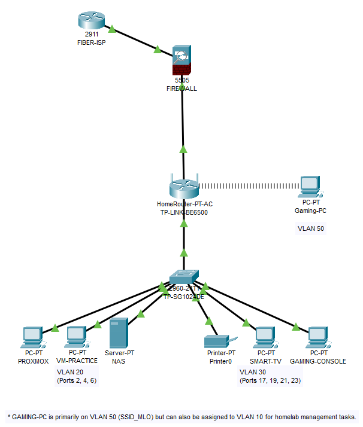

# 🏡 Home-Lab Network Infrastructure Project

This repository documents the setup and ongoing development of my personal homelab environment. While it serves as part of my professional portfolio, it is equally designed as a practical guide for others interested in creating their own homelab networks. My goal is to share both successes and challenges in a way that makes complex IT, networking, and cybersecurity concepts more approachable, user-friendly, and replicable for anyone starting their own journey.

---

## 💡 A Note on Learning & Frustration

Building a homelab can be both exciting and challenging. While this repository is designed to make concepts user-friendly, there will be times when things feel overly complicated or don’t work as expected on the first try. From personal experience, I’ve had many setbacks and moments of frustration — but those same moments make the successes far more rewarding.

If you ever get stuck, I recommend taking a day or two away from the project and returning with fresh eyes. More than likely, you won’t get everything working perfectly on the first attempt — and that’s completely normal.  

Some topics in this repository may lean more advanced, while others highlight user-friendly alternatives and products. The idea is to show multiple paths forward so you can choose the approach that fits your comfort level.

This project also assumes familiarity with common networking acronyms and jargon. If anything feels unfamiliar, a quick search will usually clarify things — and often lead you to new learning opportunities.

---

## 📊 Logical Network Topology



The diagram above represents the logical design of the homelab, including VLAN groupings, firewall placement, and switch segmentation.  

---

## 📌 Current Environment

### Router & Wireless Segmentation
- TP-Link Archer BE6500 (Wi-Fi 7) deployed as core router.  
- **SSID_MLO** → WPA3-only, for modern/high-bandwidth devices (gaming PC, PS5, Proxmox).  
- **SSID_NAME** → WPA2/WPA3 mixed mode, fallback for legacy/IoT devices.  
- Security measures applied:  
  - WPA3 prioritized, legacy fallback limited  
  - WPS disabled  
  - DNS over TLS with AdGuard DNS  
  - EasyMesh disabled  
  - Remote management disabled  
  - SPI Firewall enabled, WAN ping disabled  

[➡ View full router security & optimization notes](router_security.md)

### Switch
- **Upgraded to TP-Link TL-SG1024DE Easy Smart Switch** (previously TL-SG705 unmanaged).  
- Provides VLAN management, loop prevention, and QoS features.  
- Current VLAN assignments documented below.  

### Proxmox Virtualization
- Running on Dell OptiPlex 7020 Micro (repurposed from BitLocker lock).  
- Installed **Proxmox VE 9.0** via bootable USB (Rufus).  
- Configured:  
  - Static IP addressing  
  - Correct gateway and DNS (AdGuard)  
  - Wiped legacy partitions and allocated storage for virtualization.  
- Added basic Linux tools (`tree`) for navigation.  
- Partitioned 14GB to `lxc-storage (pve)` (not sufficient for hosting — NAS planned).  
- After struggling to determine the purpose of the Proxmox device, began attempting virtualization installs.  
  - Initial Ubuntu Server installation failed.  
  - Attempted NAS-backed Ubuntu install via UGREEN NAS — also failed.  
  - Switched to Alpine Linux as a lightweight alternative — failed again.  
  - Set project aside temporarily.  
  - Returned and successfully installed Ubuntu Server with improved resource allocation (4GB RAM, host has 8GB total).
- First successful VM deployment used to host a Minecraft server:
  - Installed Java 1.21
  - Downloaded and configured Minecraft Java Edition 1.21.8
  - Created dedicated `minecraft` user and a new file directory
  - Corrected an IP conflict caused by assigning a reserved address
  - Updated `server.properties` with the correct static IP
  - Successfully tested LAN access
  - Verified WAN functionality using dynamic DNS (external user was able to join)

### VPN
- OpenVPN server configured directly on the Archer BE6500.  
- Certificate generated and exported with DDNS hostname.  
- Client profile imported into OpenVPN Connect.  
- Remote testing verified: LAN access works, IP routing confirmed.  
- Documented sanitized screenshots of connection process.  

---

## 🖧 VLAN Segmentation

| VLAN | Purpose               | Devices / Ports                                      |
|------|------------------------|------------------------------------------------------|
| 10   | Management             | Router uplink (F0/1), Gaming PC (optional)           |
| 20   | Servers / Infra        | Proxmox (F0/2), VM Practice (F0/4), NAS (F0/6)       |
| 30   | Media / Entertainment  | Printer (F0/19), PS5 (F0/21), Smart TV (F0/23), Future Media (F0/17) |
| 40   | Wireless / IoT (2.4GHz)| Phones, IoT devices (SSID_NAME)                      |
| 50   | High-Perf Wi-Fi        | Gaming PC (SSID_MLO)                                 |

> **Note 1:** As of 2025-09-10, VLAN functionality has been temporarily disabled due to router limitations with inter-VLAN routing. See "Homelab Journal" section for more details.  
> **Note 2:** The Gaming PC is primarily assigned to VLAN 50 for high-performance Wi-Fi, but can also be temporarily assigned to VLAN 10 for homelab management (e.g., Proxmox or NAS administration).  

---

## 🛠️ Tools & Resources
- **Proxmox VE** — virtualization platform.  
- **OpenVPN Connect** — client used for VPN testing.  
- **TP-Link Tether (iOS)** — router management app.  
- **AdGuard DNS** — secure DNS filtering over TLS.  
- **ChatGPT (GPT-5.0)** — used for guided troubleshooting, documentation, and validation of commands.  

---

## 📓 Lab Journal (Changelog)

- 2025-08-20 — Replaced router with TP-Link Archer BE6500, segmented SSIDs (SSID_NAME, SSID_MLO).  
- 2025-08-21 — Reviewed DHCP ranges for static IP assignment.  
- 2025-08-22 — Added TL-SG705 switch, moved devices for QoS improvements.  
- 2025-08-24 — Flashed USB with Proxmox VE, repurposed Dell OptiPlex, wiped BitLocker partitions.  
- 2025-08-25 — Installed Proxmox, set static IP, configured AdGuard DNS.  
- 2025-08-25 — Installed Linux utilities (tree), relocated device to desk, began planning NAS and clustering.  
- 2025-08-25 — Partitioned 14GB for lxc-storage (pve); determined insufficient for self-hosting apps (NAS planned).  
- 2025-08-26 — Configured OpenVPN server on Archer BE6500. Generated certificate, set up TP-Link DDNS, exported client config, and confirmed remote VPN tunnel working.  
- 2025-08-26 — Documented VPN screenshots and created dedicated vpn_setup/ folder with guides and links.  
- 2025-08-26 — Reviewed Archer firewall/security (SPI, Access Control, IP/MAC binding, Device Isolation). Planned future IP/MAC binding for Proxmox/NAS.  
- 2025-08-29 — ISP upgraded from Spectrum 500 Mbps to Frontier Fiber 1 Gbps symmetric. Enabled testing of VPN in full-tunnel mode and improved latency for Wi-Fi 7 segmentation.  
- 2025-09-04 — Upgraded switch to TP-Link TL-SG1024DE Easy Smart Switch, replacing TL-SG705. Configured VLAN segmentation (Mgmt, Servers, Media, IoT, High-Perf Wi-Fi) and finalized logical network topology diagram for portfolio documentation.  
- 2025-09-07 — Attempted virtualization of Ubuntu and Alpine Linux on Proxmox. Also tested NAS-backed install via UGREEN NAS. All failed initially.  
- 2025-09-09 — Successfully created Ubuntu VM with 4GB RAM. Installed Java 1.21 and Minecraft Java Edition 1.21.8. Created `minecraft` user and configured server directory. Corrected static IP conflict and verified successful LAN and WAN access.  
- 2025-09-10 — VLAN isolation worked locally but failed to route externally. Devices in VLANs could not access Internet. VLAN testing disabled until inter-VLAN routing solution is implemented.  

---

## 🚧 Future Plans

- Enable **IP/MAC Binding** for critical hosts (Proxmox, NAS, main PC).  
- Configure **manual port forwarding** (replace UPnP) for gaming services (PS5, Steam, Epic).  
- Implement **VLAN segmentation** (Homelab / IoT / Personal).  
- Migrate LAN subnet from **192.168.0.0/24 → 192.168.10.0/24** for cleaner addressing.  
- Evaluate **pfSense/OPNsense** (dedicated or VM) for IDS/IPS and advanced firewall rules.  
- Deploy **virtual honeypots** (via Proxmox or Azure) for traffic logging and analysis.  
- Maintain Ubuntu VM running a Minecraft server for internal and external access.  

These future steps will continue expanding the homelab’s capabilities, with a particular focus on security, segmentation, and practical documentation. The next logical phase is exploring a dedicated firewall solution that can bridge the gap between consumer-grade routers and enterprise-style security.  

---

## 🔒 Potential Firewalla Integration

As part of that next phase, I am evaluating dedicated firewall solutions to either replace or supplement the TP-Link BE6500 router. Firewalla’s Gold series is of particular interest because it combines enterprise-grade features (IDS/IPS, VPN, VLAN segmentation) with user-friendly management that makes advanced networking more approachable.  

Planned integration goals include:  
- Demonstrating VLAN-to-SSID assignments for clean wireless segmentation.  
- Showcasing Firewalla’s IDS/IPS capabilities to monitor both internal (east-west) and external (north-south) traffic.  
- Creating beginner-friendly, step-by-step documentation to guide others transitioning from consumer routers to a Firewalla-based homelab setup.  

This integration would not only extend my own hands-on experience but also serve as a practical resource for others who want to strengthen their home networks while keeping the learning curve manageable.  

---

## Homelab Journal Entry – Stopping Point (Hardware Limitations)

At this stage in the homelab build, development has reached a **temporary stopping point** due to physical hardware constraints. The Dell OptiPlex 7020 currently only has a single onboard NIC, which prevents us from cleanly configuring OPNsense in Proxmox for proper WAN/LAN separation and VLAN routing. While a managed switch (TP-Link TL-SG1024DE) is already in place, the inability to trunk VLAN-tagged traffic onto wireless SSIDs via the TP-Link BE6500 router further limits testing and segmentation.  

### Current Limiting Factors
- **Single NIC** on the OptiPlex → cannot dedicate interfaces for WAN and LAN simultaneously in OPNsense.  
- **Router (BE6500)** → no VLAN-to-SSID tagging support.  
- **No dedicated firewall appliance** → prevents full VLAN segmentation and inter-VLAN routing at this stage.
- These limitations also impact our VPN segmentation, since remote clients currently land on the flat LAN instead of isolated VLANs.

### Next Planned Hardware Steps
- Acquire a **dedicated firewall appliance** (pfSense/OPNsense capable, multi-NIC).  
- Add a **VLAN-capable wireless access point** (TP-Link Omada or UniFi) to map SSIDs → VLANs.  
- Optionally add a **dual/quad-port Intel NIC** to the OptiPlex for more Proxmox flexibility.  

### Interim Actions
While waiting on hardware upgrades, focus will shift to:  
- **Azure Virtualization Labs** → practicing networking and virtualization concepts in a cloud environment.  
- **UGREEN NAS Virtualization Features** → exploring lightweight VM/Container options built into the NAS for additional practice and lab scenarios.  

This pause reflects a **hardware limitation rather than a configuration error**. Once new equipment is added, VLAN segmentation, OPNsense routing, and access point integration can continue in the homelab.  

---

## 📂 Repository Structure

```plaintext
├── VPN_setup/
│   ├── tplink_VPN_setup.md
│   ├── vpn_links.md
│
├── proxmox_install_setup/
│   ├── proxmox_install_setup_guide.md
│   ├── proxmox_links.md
│   ├── identify_dhcp_gateway.md
│   ├── proxmox_lxc_storage_setup.md
│
├── router_security.md
│
├── images/
│   ├── vpn/
│   ├── proxmox/
│   ├── router/
│   ├── homelab_topology.png
│
└── README.md
└── LICENSE
```

---

## ⚡ Summary

This homelab demonstrates practical networking, virtualization, and security skills using consumer hardware with enterprise concepts.  
It is intended as a **hands-on guide and learning resource** for anyone exploring homelab networking. The repository combines real-world examples, lessons learned, and alternative approaches to help others adapt these ideas to their own environments.  

This guide showcases:  
- Network segmentation strategies (SSID planning, VLAN design).  
- VPN deployment and troubleshooting with OpenVPN.  
- Virtualization using Proxmox VE on repurposed hardware.  
- Security hardening methods applied to consumer-grade routers.  
- Step-by-step documentation, including mistakes and fixes, to make learning approachable.  
- Notes on future expansion paths (dedicated firewall appliances, VLAN-capable access points, etc.), showing how advanced and user-friendly products can both fit into a homelab journey.  


