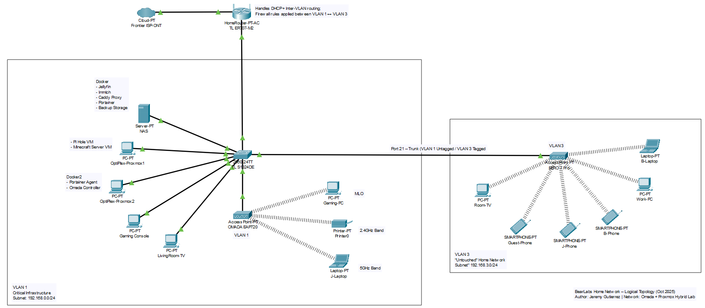

# 🧠 BearLabs 2025 – Professional Homelab Infrastructure Project  

This repository documents the **BearLabs Homelab**, a fully segmented, professionally architected hybrid network designed to demonstrate enterprise-level IT, networking, and cybersecurity concepts in a home environment.  

What began as a learning experiment on consumer hardware has evolved into a **production-grade, Omada-managed infrastructure**, integrating virtualization, network segmentation, VPN, IDS/IPS, and DNS filtering across a multi-device ecosystem.  

The project showcases a realistic approach to small-scale enterprise networking, emphasizing **scalability, security, and documentation discipline**.  

---

## 🧩 System Architecture Overview  

### **Router / Firewall Layer**
- **Device:** TP-Link **Omada ER707-M2**
- **Functions:** Core routing, DHCP, VLAN trunking, firewall management, VPN endpoint
- **Features Enabled:**
  - IDS/IPS (Intrusion Detection System) in IDS-only mode  
  - IP/MAC binding for static endpoints (Proxmox, NAS, main PC)  
  - Port forwarding for key services (Caddy HTTP/HTTPS, qBittorrent)
- **Dynamic DNS:** Custom No-IP domain ensuring VPN resilience even under ISP IP changes  
- **VPN:** New **OpenVPN** setup integrated directly within the Omada ecosystem  

### **Switch Layer**
- **Device:** TP-Link **TL-SG1024DE** Smart Managed Switch  
- Provides VLAN tagging, loop prevention, and QoS  
- Acts as trunk bridge between router, NAS, and Proxmox hosts  
- Port 21: Primary trunk port (VLAN 1 untagged / VLAN 3 tagged)  

### **Access Layer**
- **Device:** TP-Link **Omada EAP720** Wi-Fi 7 Access Point  
- VLAN-based SSID segmentation aligned with wired VLANs  
- Managed by Omada Controller VM for unified network visibility and policy enforcement  

---

## 🧱 Compute & Virtualization Layer  

| Host | Role | Key Workloads | Notes |
|------|------|----------------|-------|
| **Proxmox 1** | Network & Security Core | Pi-hole VM, Minecraft Server, (future OPNsense) | Higher RAM allocation, dedicated for infrastructure tasks |
| **Proxmox 2** | Application Layer | Docker VM running Portainer Agent + Omada Controller | 24/7 uptime, reduced dependency on main PC |
| **UGREEN NAS (4-Bay)** | Storage & Media | Caddy Proxy, Jellyfin, Immich, qBittorrent, Portainer | Serves as data hub and Docker host for media & utility containers |

> Future plans include evaluating **OPNsense** deployment on Proxmox 1 or the addition of a third OptiPlex node (Proxmox 3) for redundancy and advanced firewall routing.

---

## 🌐 Network Segmentation & VLAN Policy  

| VLAN | Subnet | Purpose | Notes |
|------|---------|----------|-------|
| **1** | 192.168.0.0/24 | Core Infrastructure | Router, Proxmox, NAS, Controller, key services |
| **3** | 192.168.30.0/24 | Stable “Untouched” Home Network | Partner and household devices — isolated from homelab VLANs |

- VLAN 3 was intentionally designed as a **stability zone**, ensuring non-technical users remain unaffected by homelab experimentation.  
- Inter-VLAN routing is controlled entirely via Omada’s internal policies.  
- DHCP reservations and DNS management are now handled by the **Omada Controller**, replacing the BE6500’s built-in system.  

---

## ⚙️ Services & Transitions  

| Service | Previous Host | Current Status | Transition Details |
|----------|----------------|----------------|--------------------|
| **Caddy Proxy** | NAS | **Active** | Still serving reverse proxy roles |
| **OpenVPN** | BE6500 Router | **Migrated** | Now integrated on ER707-M2 using No-IP DDNS |
| **Pi-hole** | Proxmox 1 VM | **Active** | Core DNS filter for all VLANs |
| **AdGuard DNS** | External | **Supplementary** | Redundant DNS layer over TLS |
| **Omada Controller** | Main PC → Proxmox 2 | **Migrated** | Now containerized and always-on |
| **Docker Stack** | Proxmox 2 | **Active** | Manages all service containers via Portainer Agent |
| **Jellyfin / Immich / qBittorrent** | NAS | **Active** | Media and file services running in Docker |
| **Minecraft Server** | Proxmox 1 | **Active** | Still running; eventual retirement planned |

---

## 🛡️ Security Framework  

BearLabs implements multiple layers of protection designed around practical enterprise security principles:

- **IDS/IPS:** Enabled in *IDS-only* mode on the Omada ER707-M2 to monitor for suspicious traffic without blocking legitimate flows.  
- **Firewall:** Rule-based isolation between VLANs; inter-VLAN routing limited to administrative hosts only.  
- **IP/MAC Binding:** Completed for static endpoints (NAS, Proxmox nodes, main workstation).  
- **DNS Filtering:** Pi-hole (local) + AdGuard DNS (TLS) stack for redundant security.  
- **VPN:** OpenVPN integrated via Omada router, secured with updated No-IP domain for reliable external access.  
- **Port Forwarding:** Configured only for essential applications (Caddy proxy and qBittorrent).  

---

## 📊 Logical Network Topology  

  
> **Figure 1.** BearLabs 2025 Logical Network Topology — Omada + Proxmox Hybrid Infrastructure  

This diagram reflects the hierarchical architecture of BearLabs, showing VLAN segmentation, traffic routing paths, and virtualization layers managed under the Omada ecosystem.

---

## 🧾 Operational Journal (Full Changelog)  

### **Foundational Phase (August 2025)**
- Replaced Spectrum ISP with **Frontier Fiber 1 Gbps symmetric** connection.  
- Installed **TP-Link Archer BE6500** as core router.  
- Segmented Wi-Fi into dual SSIDs:  
  - *SSID_MLO* (WPA3-only, high-performance devices).  
  - *SSID_NAME* (WPA2/WPA3 mixed mode for IoT and legacy).  
- Introduced **AdGuard DNS over TLS**, disabled WPS, remote management, and EasyMesh.  
- Deployed **TL-SG705 unmanaged switch** for initial Ethernet distribution.  
- Configured **OpenVPN Server** on BE6500; validated full-tunnel connection via TP-Link DDNS.  
- Installed **Proxmox VE 9.0** on a Dell OptiPlex 7020 Micro; wiped BitLocker partitions.  
- Created **lxc-storage (pve)** partition (14GB), later deemed insufficient for self-hosting.  
- Verified static IP configuration, AdGuard DNS, and gateway routing via Linux CLI.  

### **Growth Phase (September 2025)**  
- **Upgraded switch** to TL-SG1024DE Easy Smart Switch for VLAN support.  
- Began VLAN design (10–50) separating management, servers, media, IoT, and high-performance Wi-Fi.  
- Initial VLAN testing revealed **inter-VLAN routing limitations** on BE6500; VLANs disabled temporarily.  
- Successfully deployed **Ubuntu Server VM** on Proxmox with optimized 4GB RAM allocation.  
- Installed Java 1.21 and **Minecraft Java Edition 1.21.8** — confirmed LAN/WAN functionality via DDNS.  
- **Introduced NAS (UGREEN 4-bay)** with dual Seagate IronWolf 4TB drives; configured Docker workloads.  
- Migrated **Jellyfin, Immich, Portainer, and qBittorrent** to NAS; enabled persistent volume mounts.  
- **Segmented networks** into Bear1 (2.4GHz) and Bear2 (5/6GHz) Wi-Fi networks; fine-tuned QoS via switch.  
- Began **VPN documentation and screenshot repository** under `/vpn_setup/`.  

### **Infrastructure Modernization (Late September → October 2025)**  
- Retired **Archer BE6500**, deployed **TP-Link Omada ER707-M2** as the new core router/firewall.  
- Installed **Omada Controller** as a containerized service on Proxmox 2 for 24/7 management.  
- Created **VLAN 3 (192.168.30.0/24)** as a “home stability” subnet to isolate non-lab devices.  
- Migrated DHCP and reservation control from BE6500 to Omada Controller.  
- Integrated **Omada EAP720 Wi-Fi 7 AP**; enabled VLAN-based SSID segmentation.  
- Updated DNS hierarchy to Pi-hole (local) → AdGuard (TLS) → Frontier Fiber upstream.  
- Replaced TP-Link DDNS with **custom No-IP dynamic domain** for VPN resilience.  
- Configured **OpenVPN** on ER707-M2, tied to No-IP hostname, tested external reconnections.  
- Activated **IDS/IPS** on ER707-M2 in *IDS-only* mode to monitor without disrupting traffic.  
- Completed **IP/MAC binding** for static endpoints (Proxmox, NAS, main PC).  
- Configured **port forwarding** for Caddy and qBittorrent, verified via Omada logs.  
- Transitioned **Minecraft server** to maintenance mode; future decommission planned.  

---

## 💼 Professional Summary  

BearLabs demonstrates applied expertise across multiple infrastructure domains:  

- **Advanced Network Design:** VLANs, inter-VLAN routing, and Omada-based DHCP/DNS management.  
- **Virtualization & Orchestration:** Proxmox hypervisors, Docker containerization, and Portainer centralized control.  
- **Cybersecurity Implementation:** IDS/IPS monitoring, VPN tunneling, IP/MAC binding, DNS filtering.  
- **Documentation & Versioning Discipline:** GitHub-based documentation, change tracking, and visual topology references.  

This homelab reflects an enterprise mindset — prioritizing segmentation, observability, and resilience — implemented through cost-efficient hardware and scalable open-source software.

---

## 🚀 Future Roadmap  

- Deploy **OPNsense** firewall VM on Proxmox 1 for deep packet inspection and advanced traffic analytics.  
- Expand to **Proxmox 3** node for redundancy and service migration testing.  
- Implement **Omada VPN with IDS correlation** for unified monitoring.  
- Introduce **Grafana + Prometheus** stack for network and service telemetry visualization.  

---

## 🧩 Repository Structure  

```plaintext
├── vpn_setup/
│   ├── omada_openvpn_setup.md
│   ├── vpn_links.md
│
├── proxmox_virtualization/
│   ├── proxmox_install_guide.md
│   ├── proxmox_service_map.md
│
├── router_security.md
│
├── images/
│   ├── BearLab-LD.png
│   ├── proxmox/
│   ├── vpn/
│
└── README.md
└── LICENSE
