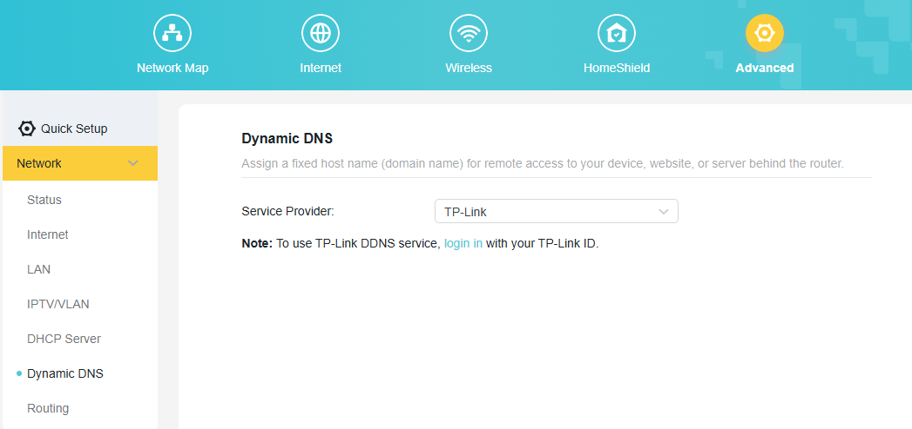
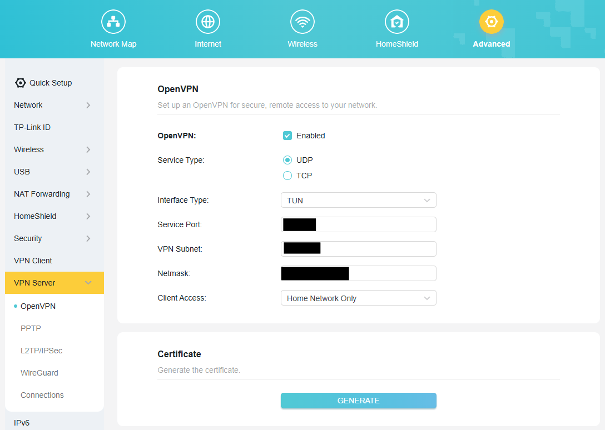
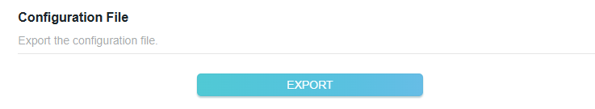
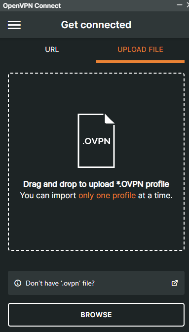
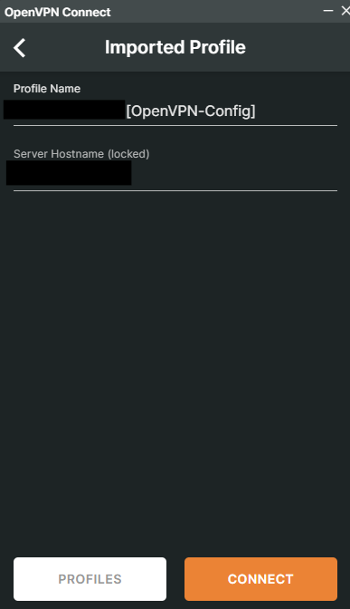
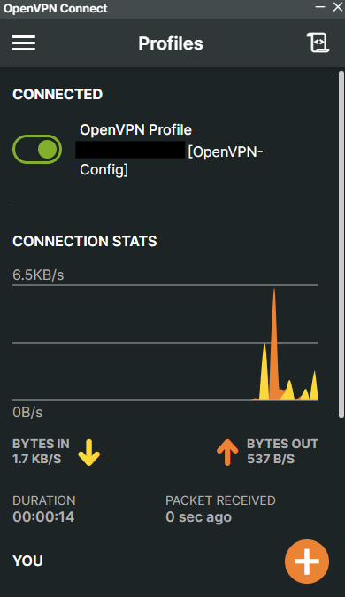
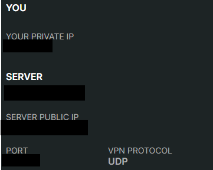
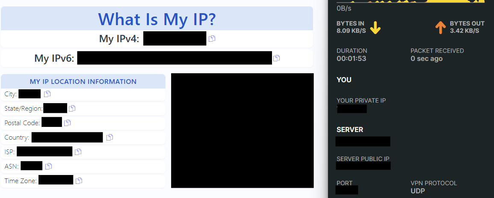

# VPN Setup with OpenVPN on TP-Link Archer BE400

This section documents the process of setting up a secure VPN for remote access to the homelab environment using the built-in OpenVPN server on the TP-Link Archer BE6500 router.  

---

## 1. Configure Dynamic DNS (DDNS)
Before enabling the VPN, set up DDNS so your exported configuration file references a hostname instead of a changing ISP IP address.  

- Navigate to **Advanced → Network → Dynamic DNS**.  
- Choose **TP-Link DDNS** (free option).  
- Log in with your TP-Link ID.  
- Register a hostname (e.g., `bearlab.tplinkdns.com`).  
- Bind and activate it.  

Once enabled, the router will automatically update TP-Link whenever your ISP changes your home IP.

---

## 2. Generate a Certificate
The OpenVPN server requires a certificate for encryption and authentication. This must be done before enabling the server.  

- Navigate to **Advanced → VPN Server → OpenVPN**.  
- In the **Certificate** section, click **Generate**.  
- Wait for the process to complete (this may take a few minutes).
- 
---

## 3. Enable the OpenVPN Server
- Still under **Advanced → VPN Server → OpenVPN**, check **Enable VPN Server**.  
- Configure:  
  - **Service Port**: Default `1194` (UDP recommended).  
  - **Protocol**: UDP (faster) or TCP (fallback if blocked).  
  - **VPN Subnet**: Default is `10.8.0.0/24` (can leave as is).  
  - **Client Access**: Choose between *Home Network Only* or *Home Network + Internet*.  

---

## 4. Export the OpenVPN Configuration File
- After enabling the server and certificate, click **Export Config**.  
- This downloads a `.ovpn` file containing:  
  - Your DDNS hostname.  
  - Encryption keys and certificates.  
  - Port and protocol information.  

)

---

## 5. Import Config to OpenVPN Client
- Download and install [OpenVPN Connect](https://openvpn.net/client/).  
- Import the `.ovpn` file on your laptop or phone.  
- Connect using your router’s credentials.  

 -> 

---

## 6. Testing the VPN
- Disconnect from home Wi-Fi and connect via mobile hotspot or hotel Wi-Fi.  
- Launch the OpenVPN client and connect.  
- Confirm:  
  - You can reach LAN devices (Proxmox, NAS, etc.).  
  - Your browsing IP shows your home ISP if using full tunnel mode.  

 -> 
--
*You can also test the connection via *[Whatismyip](https://www.whatismyip.com/)**
--

---

## Notes
- **Security:** Treat the `.ovpn` file like a password. Store securely (USB, encrypted vault).  
- **Modes:**  
  - *Home Network Only*: Only access LAN devices. Faster on limited upload speeds.  
  - *Home Network + Internet*: Encrypts *all* traffic through home network. Best when using Fiber or on untrusted Wi-Fi.  
- **Next Steps:** In future, experiment with WireGuard or pfSense for advanced VPN setups.  

---
