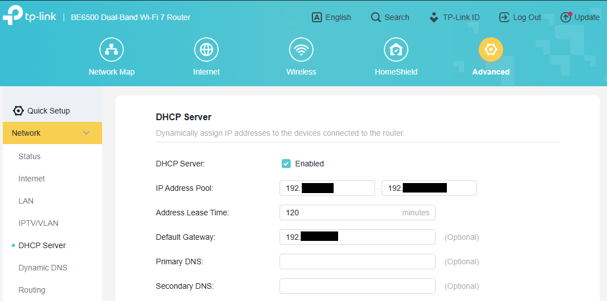

# 🌐 Identifying DHCP Settings & Gateway Info on TP-Link Archer Routers

This guide documents how I located my home network's DHCP range and default gateway using my TP-Link Archer router. This step is essential before assigning a static IP to devices like a Proxmox server or NAS.

---

## 🧭 Step 1: Access the TP-Link Archer Router Admin Page

1. Connect to your home Wi-Fi
2. Open a browser and enter one of the following in the address bar:
   - `http://192.168.0.1`
   - `http://192.168.1.1`
   - Or your custom router IP (if previously changed)

3. Log in using your admin credentials

> 🔐 *If you haven’t changed your router’s login, do so after logging in.*

---

## 📋 Step 2: Locate DHCP Settings

1. Navigate to the **Advanced** tab (top menu)
2. In the left-hand menu, go to:  
   **Network > DHCP Server**
3. You'll see:
   - **DHCP Server** 
   - **IP Address Pool**
   - **Address Lease Time**:
   - **Default Gateway**
   - **Primary DNS**
   - **Secondary DNS** 



---

## ✅ Step 3: Identify a Static IP to Assign

To avoid IP conflicts:
- Choose an IP **outside the DHCP range**, but within the same subnet

Example:

| Setting        | Value                    |
|----------------|---------------------------|
| Router IP      | `192.168.1.1`             |
| DHCP Range     | `192.168.1.100`–`192.168.1.199` |
| Valid Static IP| `192.168.1.10`, `192.168.1.250`, etc. |

⚠️ Make sure the static IP:
- Is **not used by any other device**
- Resides within the subnet (e.g., `192.168.1.0/24`)

---

## 📌 Optional: Cross-Verify from a Client Device

You can also run this from a connected PC or laptop:

### On Windows:
```powershell
ipconfig
```

Look for:
- **Default Gateway**
- **IPv4 Address**
- **Subnet Mask**

### On Linux/macOS:
```bash
ip route | grep default
ip a
```

---

## 🧠 Summary

- The **router's LAN IP** is your **default gateway**
- The **DHCP range** tells you which IPs are automatically handed out
- You should assign **static IPs outside** this range but in the same subnet

This is the groundwork for setting static IPs for Proxmox, DNS servers, NAS devices, and other homelab systems.

---
