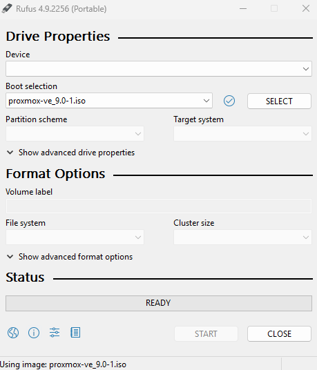
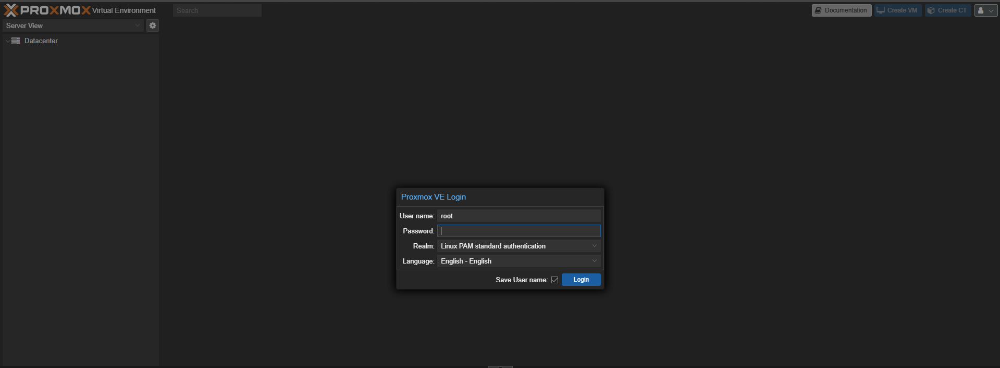
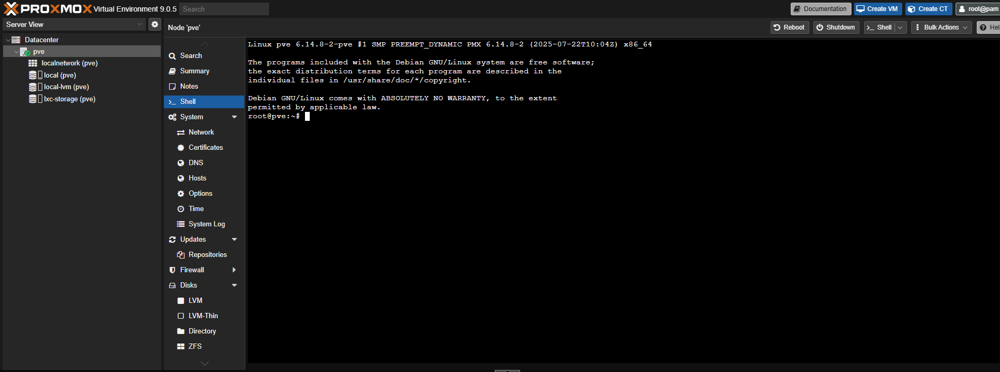

# 🖥️ Proxmox Installation Setup Guide

This document outlines the exact steps I followed to install Proxmox VE, beginning with creating a bootable USB drive, all the way to completing installation on my target system.

---

## 🧰 Step 1: Create a Bootable USB with Proxmox ISO

### Tools Needed:
- A USB flash drive (minimum 4GB)
- [Rufus](https://rufus.ie/) or similar tool (e.g., Balena Etcher, Ventoy)
- Proxmox ISO from [https://www.proxmox.com/en/downloads](https://www.proxmox.com/en/downloads)

### Instructions:

1. Plug in your USB flash drive.
2. Launch **Rufus**.
3. Under `Device`, select your USB drive.
4. Under `Boot selection`, click `SELECT` and choose the **Proxmox ISO** you downloaded.
5. Leave the default Partition scheme as **MBR** (unless you're targeting UEFI/GPT only).
6. Click **Start** and confirm when prompted.





---

## 🔧 Step 2: Boot the Target Machine from USB

1. Insert the USB into your target machine.
2. Power on and immediately press the boot menu key (`F12`, `Esc`, or `F2` depending on your BIOS).
3. Select the USB flash drive to boot from.
4. Choose **Install Proxmox VE** from the boot screen.

---

## 📥 Step 3: Follow the Proxmox Installer

1. Accept the license agreement.
2. Choose your installation target disk (e.g., your NVMe or SSD).
3. Set a password and email address.
4. Configure your management network IP (static recommended).
5. Finalize and begin installation.

---

## ✅ Step 4: First Boot

Once installation completes:
1. Remove the USB drive.
2. Reboot the system.
3. Open a browser on your local network and go to:

```text
https://your-proxmox-ip-address:8006
```

4. Log in using the credentials you set during installation.

---

## 📌 Optional Post-Install To-Do List

- Run updates from the web UI or shell:
  ```bash
  apt update && apt full-upgrade -y
  ```
- Set static IP if not done during install
- Enable enterprise or no-subscription repo
- Install necessary packages (e.g., `htop`, `tree`)
- Configure Proxmox firewall and VLANs (if applicable)

---

🧠 You’re now ready to begin containerization, virtualization, or homelab exploration.


*This README is part of a larger documentation series for building a full Proxmox-powered homelab.*
