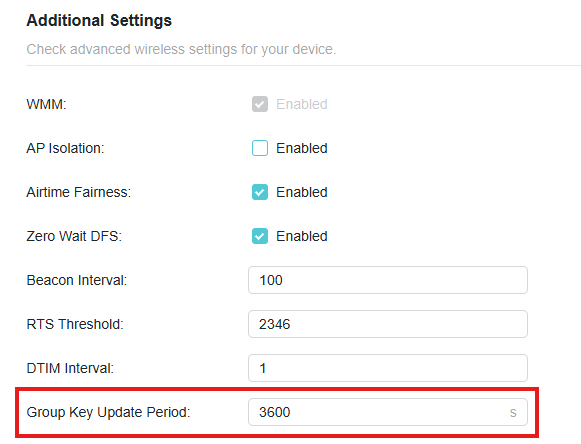
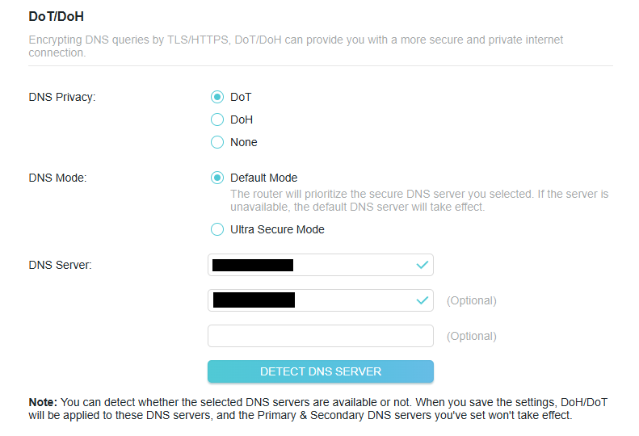
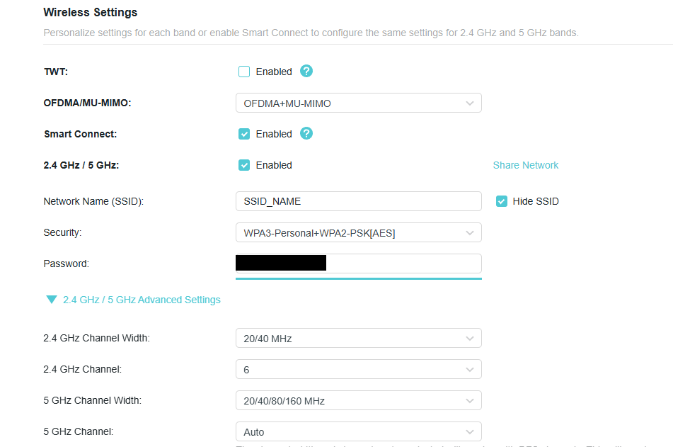
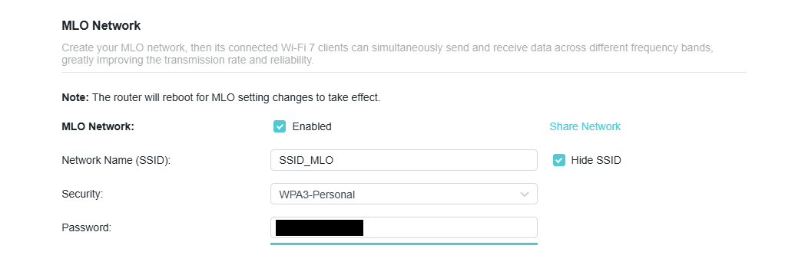

# 🛡️ Home Network Security & Optimization

This document captures the security hardening and wireless optimization applied to the TP‑Link Archer BE6500 (Wi‑Fi 7) after upgrading to Frontier Fiber 1 Gbps. It complements the VPN and Proxmox setup guides in this repository.

---

## ✅ Security Hardening

### Wi‑Fi Encryption
- **SSID_MLO**: WPA3‑Personal (primary network for modern devices).  
- **SSID_NAME**: WPA2/WPA3 mixed mode (legacy compatibility).  
- **Why**: Ensures modern clients prefer WPA3 while older devices can still connect.

### WPS Disabled
- **Why**: Removes a well‑known brute‑force attack vector (PIN method).

### Group Key Update Period → 3600s
- **Why**: Forces hourly re‑keying to limit risks from long‑term key reuse/replay.

### DNS over TLS (DoT) with AdGuard DNS
- **What**: Encrypted DNS lookups and filtering for ads, trackers, malicious domains.  
- **Why**: Improves privacy and reduces junk traffic at the network edge.

---

## ⚡ Wireless Optimization

### Channel Configuration
- **2.4 GHz**: Locked to **Channel 6**, **20 MHz** width for stability in congested bands.  
- **5 GHz**: **Auto channel** with **DFS enabled** for higher throughput and less congestion.

 

### Advanced Wireless Features
- **Airtime Fairness**, **MU‑MIMO**, and **OFDMA**: **Enabled** for efficient multi‑client performance (Wi‑Fi 6/7).  
- **DTIM Interval**: Left at **1** for better latency on real‑time apps.  
- **Beacon/RTS/Other**: Kept at stable defaults per vendor guidance.

### SSID Strategy
- **SSID_MLO** → WPA3‑only, main SSID for modern devices.  
- **SSID_NAME** → WPA2/WPA3 mixed, fallback for older clients.  
- **Guest/IoT** → Deferred for now.

---

## 🔒 Network Controls

### Client Identification
- **What**: Renamed known clients (PC, work PC, phone); monitored device list for unknowns (discarded transient “Android” blip).

### Future: IP & MAC Binding (ARP Binding)
- **Goal**: Prevent LAN ARP spoofing by binding static IPs to MACs for critical hosts.  
- **Planned bindings**:  
  - Proxmox host  
  - NAS (when added)  
  - Main PC  
  - *(Optional)* PS5 & phone

### Access Control
- **Current**: Disabled (monitor‑only posture).  
- **Future**: Consider **Allow‑List** mode for small, tightly‑controlled LANs.

---

## 🌐 NAT & Gaming Considerations

### UPnP
- **Current**: **ON** for easier gameplay/connectivity on consoles/PC.  
- **Future**: Plan to disable and replace with manual port forwards for tighter control.

### (Future) Manual Port Forwarding References
- **PS5**: TCP **80, 443, 3478–3480** / UDP **3478–3479**  
- **Steam**: UDP **27000–27100**, UDP/TCP **27031–27036**  
- **Epic Games**: TCP/UDP **80**, TCP **443**, UDP **3478–3479**  
- *(Other launchers seldom need custom rules.)*

---

## 🚧 Future Considerations

### LAN Redesign
- Migrate LAN from **192.168.0.0/24 → 192.168.10.0/24** for cleaner addressing.  
- Reserve static IPs for Proxmox, NAS, main PC; DHCP pool for general devices.

### Segmentation / VLANs
- Potential future isolation for **Homelab**, **Personal**, **IoT** networks.

### Dedicated Firewall (pfSense/OPNsense or Proxmox VM)
- Advanced rules, IDS/IPS, full logging/monitoring, and per‑device VPN policies.

---

## ⚡ TL;DR
- Disabled risky defaults (WPS, remote management, EasyMesh).  
- Hardened wireless (WPA3 first, hourly key rotation, channel optimization).  
- Secured DNS via **AdGuard over DoT**.  
- Staged next steps: **IP/MAC binding**, VLANs, and a **dedicated firewall**.

---
